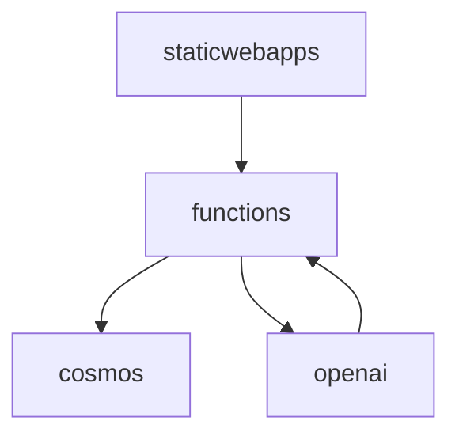

# cinest
A movie suggestion engine, build with love and Azure

## notes
### services
- azure cosmos db for postgresql - to store movie data (movie names, genres, directors, main actors)
- azure functions - back-end
- azure static web apps - front end
- openai - for suggestions (azure openai)

## Local development
Dependencies:
- Docker
- Docker Compose
- Python 3.11+
- Node 18.16+

- Run `npm run dev` to start the front-end
- Run `docker-compose up -d` to run the API and database in containers for local development