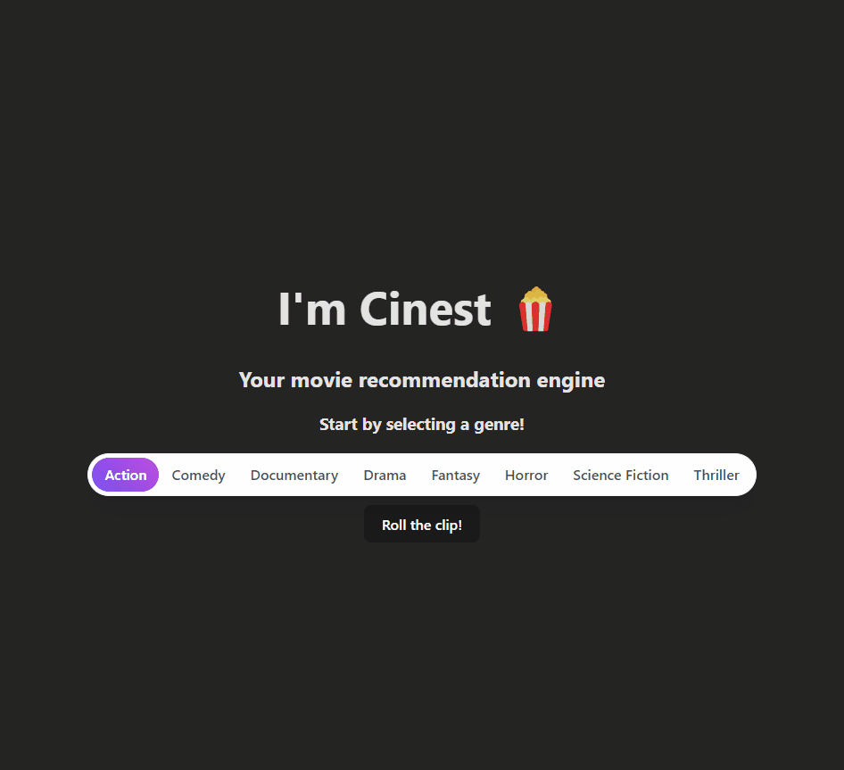

# cinest
A movie suggestion engine, built with love and Azure!

## Local development
Dependencies:
- Docker
- Docker Compose
- Python 3.11+
- Node 18.16+

### Frontend
1. Run `npm install` in `frontend/`
1. Run `npm run dev` to start dev server

### API
You will need API keys for [OMDb API](https://ombdapi.com/) (free!) and [OpenAI](https://platform.openai.com/overview). Once you get these, store them in a `.env` file in the root of the project as `OMDB_API_KEY` and `OPENAI_API_KEY`.
1. Create venv or open in Dev Container
1. Install deps via `pip install -r requirements.txt`
1. In root of project (`/`), run `docker-compose up -d` to run the API and database in containers for local development
